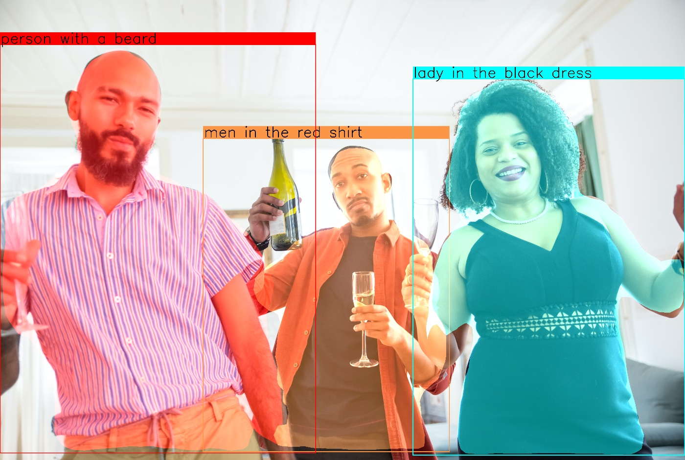

# pytorch_clip_bbox: Implementation of the CLIP guided bbox refinement for Object Detection.

<p align="center">
  
</p>

Pytorch based library to filter predicted bounding boxes using text/image user's prompts.

Usually, object detection models trains to detect common classes of objects such as "car", "person", "cup", "bottle".
But sometimes we need to detect more complex classes such as "lady in the red dress", "bottle of whiskey", or "where is my red cup" instead of "person", "bottle", "cup" respectively.
One way to solve this problem is to train more complex detectors that can detect more complex classes,
but we propose to use text-driven object detection that allows detecting any complex classes that can be described by natural language.
This library is written to filter predicted bounding boxes using text/image descriptions of complex classes.

## Install package

```bash
pip install pytorch_clip_bbox
```

## Install the latest version

```bash
pip install --upgrade git+https://github.com/bes-dev/pytorch_clip_bbox.git
```

## Features
- The library supports multiple prompts (images or texts) as targets for filtering.
- The library automatically detects the language of the input text, and multilingual translate it via google translate.
- The library supports the original CLIP model by OpenAI and ruCLIP model by SberAI.
- Simple integration with different object detection models.

## Usage

### Simple example to integrate pytorch_clip_bbox with yolov5 model

```bash
$ pip install -r examples/yolov5_requirements.txt
```

```python
import argparse
import cv2
import torch
from pytorch_clip_bbox import ClipBBOX

def extract_boxes(detections):
    boxes = []
    for i in range(detections.xyxy[0].size(0)):
        x1, y1, x2, y2, confidence, idx = detections.xyxy[0][i]
        boxes.append([int(x1), int(y1), int(x2-x1), int(y2-y1)])
    return boxes

def main(args):
    # build detector
    detector = torch.hub.load("ultralytics/yolov5", "yolov5s").to(args.device)
    clip_bbox = ClipBBOX(clip_type=args.clip_type).to(args.device)
    # add prompts
    if args.text_prompt is not None:
        clip_bbox.add_prompt(text=args.text_prompt)
    if args.image_prompt is not None:
        image = cv2.cvtColor(cv2.imread(args.image_prompt), cv2.COLOR_BGR2RGB)
        image = torch.from_numpy(image).permute(2, 0, 1).unsqueeze(0)
        image = img / 255.0
        clip_bbox.add_prompt(image=image)
    image = cv2.cvtColor(cv2.imread(args.image), cv2.COLOR_BGR2RGB)
    detections = detector(image)
    boxes = extract_boxes(detections)
    filtered_boxes = clip_bbox(image, top_k=args.top_k)
    screen = cv2.cvtColor(image, cv2.COLOR_RGB2BGR)
    for box in filtered_boxes:
        x, y, w, h = box["rect"]
        cv2.rectangle(image, (x, y), (x + w, y + h), (0, 255, 0), 4)
    if args.output_image is None:
        cv2.imshow("image", images)
        cv2.waitKey()
    else:
        cv2.imwrite(args.output_image, image)


if __name__ == "__main__":
    parser = argparse.ArgumentParser()
    parser.add_argument("-i", "--image", type=str, help="Input image.")
    parser.add_argument("--device", type=str, default="cuda:0", help="inference device.")
    parser.add_argument("--text-prompt", type=str, default=None, help="Text prompt.")
    parser.add_argument("--image-prompt", type=str, default=None, help="Image prompt.")
    parser.add_argument("--clip-type", type=str, default="clip_vit_b32", help="Type of CLIP model [ruclip, clip_vit_b32, clip_vit_b16].")
    parser.add_argument("--top-k", type=int, default=1, help="top_k predictions will be returned.")
    parser.add_argument("--output-image", type=str, default=None, help="Output image name.")
    args = parser.parse_args()
    main(args)
```